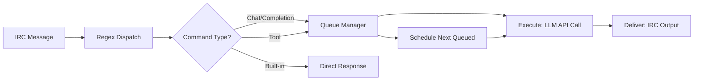

<div align="center">

# dave

### The IRC chatbot that brings LLMs, MCP tools & image generation straight to your channels

[](go.mod)
[](https://goreportcard.com/report/github.com/knivey/dave)
[](LICENSE)
[](https://pkg.go.dev/github.com/knivey/dave)
[](../../pulls)

[](https://en.wikipedia.org/wiki/Internet_Relay_Chat)
[](https://platform.openai.com/docs/api-reference)
[](https://modelcontextprotocol.io/)
[](https://github.com/comfyanonymous/ComfyUI)
[](https://toml.io)
[](https://sqlite.org)

**Single binary · TOML-driven · Multi-network · Streaming · TUI · MCP · Image gen**

</div>

---

> **TL;DR** — One Go binary. Point it at any OpenAI-compatible API and an IRC server. Chat, generate images, run MCP tools. Done.

---

## Table of Contents

- [Features](#-features)
- [Why dave?](#-why-dave)
- [Quick Start](#-quick-start)
- [Configuration](#%E2%9A%99%EF%B8%8F-configuration)
- [Usage](#%F0%9F%92%AC-usage)
- [In Action](#-in-action)
- [Image Generation MCP](#%F0%9F%96%BC%EF%B8%8F-image-generation-mcp-img-mcp)
- [Architecture](#%F0%9F%8F%97%EF%B8%8F-architecture)
- [Testing](#%F0%9F%A7%AA-testing)
- [Advanced](#%F0%9F%94%A7-advanced)
- [Dependencies](#%F0%9F%93%A6-dependencies)
- [Contributing](#%F0%9F%A4%9D-contributing)
- [License](#%F0%9F%93%9D-license)

---

## ✨ Features

<table>
<tr>
<td width="50%">

### 🧠 LLM Chat & Completions
- **Chat API** with persistent per-user context history (SQLite-backed sessions)
- **Completion API** for one-shot prompts
- **Streaming** — watch responses arrive in real-time
- **System prompt templates** using Go's `text/template` with `{{.Nick}}`, `{{.Channel}}`, `{{.Network}}`, `{{.ChanNicks}}`, `{{.Vars.*}}` (custom vars via TOML); supports conditionals, comparisons, and basic logic
- Markdown → IRC formatting (bold, color, underline, tables, code blocks)
- Multiple services: OpenAI, Grok/xAI, local vLLM, OpenRouter, any OpenAI-compatible API

</td>
<td width="50%">

### 🖼️ Image Generation
- **ComfyUI integration** via bundled MCP server (`img-mcp`)
- LLM-powered **prompt enhancement** before generation
- Multiple workflow support (SDXL, Flux, custom)
- Async job queue with status, cancel, and auto-delivery
- Automatic image upload & URL hosting

</td>
</tr>
<tr>
<td width="50%">

### 🔌 MCP (Model Context Protocol)
- Connect **any MCP server** via stdio or HTTP
- MCP tools auto-injected into LLM requests (opt-in per command)
- Resources & prompts via MCP
- Auto-reconnect with exponential backoff
- KeepAlive pings for HTTP sessions

</td>
<td width="50%">

### 🖥️ Built-in TUI
- **tview**-based terminal UI with scrollback & mouse scroll support
- Configurable scrollbar (color, track, visibility)
- Command history (↑/↓), PgUp/PgDn navigation
- Runtime commands: `/reload`, `/join`, `/part`, `/nick`, `/quit`
- ANSI color log output
- Set `DAVE_NO_TUI=1` to run headless

</td>
</tr>
<tr>
<td width="50%">

### 🌐 Multi-Network IRC
- Connect to **multiple IRC networks** simultaneously
- Multiple servers per network with round-robin failover
- Auto-reconnect (60s interval)
- Per-network throttle, trigger, quit message
- SASL / server password support
- Wildcard-based host ignores (`ignores.txt`)

</td>
<td width="50%">

### 👁️ Vision / Image Detection
- Users paste image URLs in chat → bot downloads & sends to vision models
- Auto-resize, convert (JPG/WebP), compress
- Configurable max images per message & per context
- Works with GPT-4o, Gemini, any vision-capable model

</td>
</tr>
<tr>
<td width="50%">

### 📋 Request Queue
- Per-user queue with position notifications (no more "busy" rejections)
- Per-service **parallelism** — serialized by default (`parallel = 1`), `0` = unlimited
- Natural prefetching: next user's LLM call starts while current response delivers
- `-stop` cancels current request and auto-starts the next queued item
- `-jobs` shows queue status + background async jobs
- Configurable max queue depth per user

</td>
</tr>
</table>

---

## ⚡ Why dave?

A comparison with [aibird](https://github.com/birdneststream/aibird), another Go IRC bot with AI features:

| | **dave** | [**aibird**](https://github.com/birdneststream/aibird) |
|---|:---:|:---:|
| **Config** | TOML directory (per-file) | Single TOML file |
| **Hot reload** | ✅ `/reload` without restart | ❌ |
| **Built-in TUI** | ✅ tview terminal UI | ❌ |
| **LLM streaming** | ✅ real-time delivery | ❌ |
| **MCP tool support** | ✅ any MCP server | ❌ |
| **Per-user request queue** | ✅ with prefetching | GPU-only queue |
| **Session persistence** | ✅ SQLite + resume | ❌ |
| **Markdown → IRC** | ✅ tables, code, colors | ❌ |
| **Multi-provider** | ✅ any OpenAI-compatible API | OpenRouter, Gemini |
| **Vision / image detect** | ✅ paste URLs in chat | ❌ |
| **Image generation** | ✅ ComfyUI via MCP | ✅ ComfyUI direct |
| **Prompt enhancement** | ✅ LLM-powered | ❌ |
| **System prompt templates** | ✅ Go templates + vars | ✅ personalities |
| **SASL support** | ✅ | ✅ |
| **Multi-network** | ✅ | ✅ |
| **Auto-reconnect** | ✅ exponential backoff | ✅ |
| **Doc completeness** | ✅ documented config | partial docs |

---

## 🚀 Quick Start

### Prerequisites

- **Go 1.25+**
- An OpenAI-compatible API key (OpenAI, Grok, local vLLM, etc.)
- An IRC server to connect to

### Build & Run

```bash
# Clone
git clone https://github.com/knivey/dave.git
cd dave

# Build (dave + all MCP servers)
./build.sh

# Or build just dave
go build -o dave .

# Copy and edit config
cp -r config prod
$EDITOR prod/config.toml prod/services.toml

# Run (uses prod/ directory)
./dave prod
```

That's it. The TUI appears, the bot connects, and you're live.

<details>
<summary><b>🐳 Running headless (no TUI)</b></summary>

```bash
DAVE_NO_TUI=1 ./dave prod
```

Output goes to stdout/stderr. Great for systemd, Docker, or screen/tmux.
</details>

<details>
<summary><b>📦 Building MCP servers individually</b></summary>

```bash
# Build the image generation MCP server
go build -o mcps/img-mcp/img-mcp ./mcps/img-mcp

# Build everything with the build script
./build.sh
```

See the [Image Generation MCP](#%F0%9F%96%BC%EF%B8%8F-image-generation-mcp-img-mcp) section for full img-mcp setup.
</details>

### Config Directory Structure

```
prod/
├── config.toml              # Networks, trigger, queue, global settings
├── services.toml            # API keys, base URLs, parallelism
├── chats.toml               # Chat commands (persistent context)
├── completions.toml         # Completion commands (one-shot)
├── tools.toml               # MCP tool commands
├── mcps.toml                # MCP server connections
└── templatevars.toml        # Custom template variables (optional)

# These live in the working directory (where you run ./dave):
contexts.json                # Legacy persistent chat history (auto-created)
data/dave.db                 # SQLite database (sessions, messages, jobs)
ignores.txt                  # Wildcard host ignores (optional)
```

---

## ⚙️ Configuration

### `config.toml` — Networks & Globals

```toml
trigger = "-"
quitmsg = "unplugged"
uploadurl = "https://upload.beer"

queue_msgs = ["queued (position {position})"]
started_msg = "\x0306\u25b6 {nick}: Processing your request (waited {wait})...\x0f"
max_queue_depth = 5
ratemsgs = ["whoa!! slow down!!!"]

[database]
path = "data/dave.db"
max_age_days = 90

[tui]
scrollback_lines = 5000

[tui.scrollbar]
visible = true
show_always = true
color = "gray"
background_color = "black"
track_color = "darkgray"
width = 1

[api_log]
enabled = true
dir = "api_logs"

[networks.libera]
enabled = true
nick = "dave"
throttle = 750
channels = ["#mychannel"]
[[networks.libera.servers]]
host = "irc.libera.chat"
ssl = true
port = 6697
```

### `services.toml` — API Endpoints

```toml
[openai]
key = "sk-..."
baseurl = "https://api.openai.com/v1/"
maxcompletiontokens = 600
temperature = 0.7
# parallel = 1          # Concurrent LLM calls (default: 1 = serialized, 0 = unlimited)
# toolverbose = true    # Show tool call notifications in IRC (default: true)
# paralleltoolcalls = true  # Enable parallel MCP tool calls (default: true, cascades)

[local]
baseurl = "http://localhost:8000/v1"
maxtokens = 500
maxhistory = 8
parallel = 2  # Allow 2 concurrent requests on this service

[grok]
key = "xai-..."
baseurl = "https://api.x.ai/v1/"
maxtokens = 6000
temperature = 0.7
```

### `chats.toml` — Chat Commands

```toml
[chat]
description = "General IRC-aware chat"
service = "openai"
model = "gpt-4o"
renderMarkdown = true
system = """\
You are dave, a chatbot on IRC that responds using IRC formatting.
IRC Color Codes: 04=Red, 09=Light Green, 12=Light Blue ...
"""

[yo]
service = "local"
streaming = true
system = "you are an unprofessional and rude chatbot..."

[view]
description = "Chat with image detection"
service = "openai"
model = "gpt-4o"
detectimages = true
maximages = 2
system = "You are dave chatting with {{.Nick}} in {{.Channel}} on {{.Network}}."
```

### `mcps.toml` — MCP Servers

```toml
[img-mcp]
transport = "stdio"
command = "./mcps/img-mcp/img-mcp"
timeout = "2m"

[github]
transport = "http"
url = "http://localhost:3001/mcp"
timeout = "30s"
```

### `tools.toml` — MCP Tool Commands

```toml
[qwen]
description = "Qwen enhanced image generation"
mcp = "img-mcp"
tool = "enhance_and_generate"
arg = "prompt"
timeout = "2m"
args = { workflow = "qwen", output_format = "url" }

[queue]
description = "View generation queue status"
mcp = "img-mcp"
tool = "queue_status"
skipbusy = true
```

### `templatevars.toml` — Custom Template Variables

Define reusable values injected into system prompts as `{{.Vars.*}}`:

```toml
# templatevars.toml
BotPersonality = "You are sarcastic but helpful."
ChannelRules = "No spam. Keep it chill."
AllowedTopics = "programming, gaming, music, shitposting"
AsyncToolsNote = "Async tools return a job_id immediately. Do not poll or wait for results."
```

```toml
# chats.toml — reference them in any system prompt
[chat]
system = """\
{{.Vars.BotPersonality}}

Channel rules: {{.Vars.ChannelRules}}
Allowed topics: {{.Vars.AllowedTopics}}

You are {{.BotNick}} in {{.Channel}} on {{.Network}}.
Users: {{.ChanNicks}}
"""
```

**Available template variables:**

| Variable | Description |
|----------|-------------|
| `{{.Nick}}` | Caller's nickname |
| `{{.BotNick}}` | Bot's nickname |
| `{{.Channel}}` | Channel name |
| `{{.Network}}` | Network name (exactly as defined in `config.toml` under `[networks.*]`) |
| `{{.ChanNicks}}` | JSON array of all users in the channel |
| `{{.Vars.*}}` | Any custom key from `templatevars.toml` |

Templates use Go's `text/template` syntax and support conditionals (`{{if}}`, `{{else}}`), comparisons (`eq`, `ne`, `lt`, `gt`), and logical operators (`and`, `or`, `not`).

Example: Network-specific behavior
```toml
[conditional-chat]
service = "openai"
model = "gpt-4o"
system = """\
{{if eq .Network "libera"}}You are on Libera Chat. Be professional.
{{else if eq .Network "efnet"}}You are on EFNet. Be casual.
{{else}}You are on {{.Network}}. Be friendly.{{end}}
"""
```

Example: Exclude specific networks
```toml
[restricted-chat]
service = "openai"
model = "gpt-4o"
system = """\
{{if ne .Network "private-net"}}You are chatting in a public channel. Be helpful and friendly.
{{else}}You are in a private network. Follow strict confidentiality rules.{{end}}
"""
```

Example: Multiple conditions with `and` / `or`
```toml
[complex-conditional]
service = "openai"
model = "gpt-4o"
system = """\
{{if and (eq .Network "libera") (eq .Channel "#programming")}}You are in the Libera #programming channel. Be technical and precise.
{{else if or (eq .Network "private") (eq .Channel "#admin")}}You are in a restricted area. Follow strict protocols.{{end}}
"""
```

Custom variables are **hot-reloadable** — edit `templatevars.toml` and type `/reload` to update without restart. Missing file = empty map (not fatal).

---

## 💬 Usage

### Starting a Chat

```
<knivey> -chat how are you today?
<dave>   I'm doing well! How can I help you?
```

### Continuing a Conversation

Just reply to the bot's nick:

```
<knivey> dave: tell me more about that
<dave>   Sure! Here's the details...
```

### Image Generation

```
<knivey> -qwen a sunset over mountains
<dave>   https://upload.beer/abc123.jpg
<dave>   All done ;)
```

### Stop Generation

```
<knivey> -stop
```

Cancels the current response and auto-starts the next queued request (if any).

### Check Queue & Jobs

```
<knivey> -jobs
```

Shows your queue position/status and any background async jobs.

### Session History

```
<knivey> -sessions
<knivey> -history <id>
<knivey> -resume <id>
<knivey> -delete <id>
<knivey> -mystats
```

### Help

```
<knivey> -help
<knivey> -help chat
```

### Built-in TUI Commands

| Command | Description |
|---------|-------------|
| `/help` | Show TUI commands |
| `/reload` | Hot-reload config from disk |
| `/join <net> <chan>` | Join a channel |
| `/part <net> <chan> [msg]` | Leave a channel |
| `/nick <net> <nick>` | Change nickname |
| `/quit` | Shut down the bot |

---

## 📸 In Action

<table>
<tr>
<td width="50%" valign="top">

**💬 Persistent Chat Context**

```
<knivey> -chat what's a good
         pasta recipe?
<dave>   Here's a classic 
         carbonara...
<knivey> dave: make it spicy
<dave>   Adding chili flakes 
         and Calabrian peppers...
```

</td>
<td width="50%" valign="top">

**🖼️ Image Generation**

```
<knivey> -qwen cyberpunk city
         at night, neon rain
<dave>   🔧 Generating image...
<dave>   https://i.upload.beer/a1b2.jpg
<dave>   All done ;)
```

</td>
</tr>
<tr>
<td width="50%" valign="top">

**📋 Queue Management**

```
<knivey> -chat explain quantum 
         computing
<dave>   queued (position 1)
<dave>   ▶ knivey: Processing 
         your request (waited 4s)...
<dave>   Quantum computing uses 
         qubits which...
```

</td>
<td width="50%" valign="top">

**👁️ Vision Detection**

```
<knivey> -view what do you see 
         here? https://img.io/cat.jpg
<dave>   That's an orange tabby 
         cat sitting on a windowsill,
         looking outside...
```

</td>
</tr>
<tr>
<td width="50%" valign="top">

**🔄 Session History**

```
<knivey> -sessions
<dave>   Session History (knivey):
         ● #12  5 msgs  2m  -chat  
           what's a good pasta recipe?
         ○ #11  12 msgs 1h  -view  
           analyze this circuit board

<knivey> -resume 11
<dave>   Resumed session #11 
         (view) with 12 messages.
```

</td>
<td width="50%" valign="top">

**🛑 Stop & Cancel**

```
<knivey> -chat write a novel
<dave>   It was a dark and 
         stormy night in the
         small town of...
<knivey> -stop
         (generation stopped)
```

</td>
</tr>
</table>

---

## 🖼️ Image Generation MCP (`img-mcp`)

The bundled `img-mcp` server provides ComfyUI-powered image generation with prompt enhancement.

### Build

```bash
go build -o mcps/img-mcp/img-mcp ./mcps/img-mcp
```

### Configure

Copy and edit the example config:

```bash
cp mcps/img-mcp/example.toml mcps/img-mcp/config.toml
```

Key sections in the config:

```toml
[comfy]
baseurl = "http://localhost:8188"
default_workflow = "zimage"

[upload]
url = "https://upload.example.com"

[enhancement.default]
baseurl = "https://api.x.ai/v1/"
key = "YOUR_KEY"
model = "grok-4-1-fast-reasoning"
systemprompt = "You are an expert at writing prompts for AI image generation..."

[workflow.zimage]
workflow_path = "workflows/z_image_turbo.json"
output_node = "28"
prompt_node = "6"
```

### Run

```bash
# stdio mode (launched by dave automatically)
./mcps/img-mcp/img-mcp

# HTTP mode
./mcps/img-mcp/img-mcp --http
```

### Available Tools

| Tool | Description |
|------|-------------|
| `enhance_prompt` | Enhance a raw prompt using LLM |
| `generate_image` | Generate image (sync, waits for result) |
| `generate_image_async` | Generate image (async, returns job ID) |
| `enhance_and_generate` | Enhance + generate (sync) |
| `enhance_and_generate_async` | Enhance + generate (async) |
| `queue_status` | View job queue state |
| `job_status` | Check a specific job |
| `list_jobs` | List jobs with optional filter |
| `cancel_job` | Cancel a queued/running job |
| `list_workflows` | List available workflows |
| `list_enhancements` | List enhancement configs |
| `upload_image` | Upload base64 image data |

---

## 🏗️ Architecture

```
┌─────────────────────────────────────────────────────────┐
│                        dave (main)                       │
│                                                          │
│  ┌──────────┐  ┌──────────┐  ┌──────────┐  ┌────────┐ │
│  │  config/  │  │   TUI    │  │  IRC     │  │Context │ │
│  │  (TOML)   │  │ (tview)  │  │ (girc)   │  │ Store  │ │
│  └─────┬────┘  └────┬─────┘  └────┬─────┘  └───┬────┘ │
│        │            │             │              │       │
│  ┌─────┴────────────┴─────────────┴────────────┴─────┐ │
│  │              Command Dispatch (regex)               │ │
│  │  builtInCmds (stop, help) + configCmds (hot-swap)  │ │
│  └──┬──────────────┬──────────────────┬───────────────┘ │
│     │              │                  │                  │
│  ┌──┴──────────────┴──────────────────┴───────────────┐ │
│  │                  Queue Manager                      │ │
│  │  Per-user queue · Per-service parallelism · Prefetch│ │
│  └──┬──────────────┬──────────────────┬───────────────┘ │
│     │              │                  │                  │
│  ┌──┴───┐    ┌─────┴──────┐    ┌──────┴──────┐         │
│  │Chat  │    │Completion  │    │  MCP Tools  │         │
│  │(API) │    │  (API)     │    │  (any MCP)  │         │
│  └──┬───┘    └────────────┘    └──────┬──────┘         │
│     │                                  │                 │
│  ┌──┴──────────────┐          ┌────────┴────────┐       │
│  │ MarkdownToIRC   │          │    img-mcp      │       │
│  │ (goldmark+IRC)  │          │  (ComfyUI MCP)  │       │
│  └─────────────────┘          └─────────────────┘       │
│                                                          │
│  ┌──────────────────────────────────────────────────┐   │
│  │          SQLite (sessions, messages, jobs)        │   │
│  └──────────────────────────────────────────────────┘   │
└─────────────────────────────────────────────────────────┘
```

### Data Flow



### Key Design Decisions

- **Single binary** — no runtime dependencies, no npm/node, just Go
- **Config directory** — each file has a purpose, hot-reloadable without restart
- **Atomic command swap** — `configCmds` replaced as a whole map, never mutated in-place
- **Per-user queue** — requests are queued with position notifications instead of rejected when busy
- **Exec/delivery decoupling** — LLM calls and IRC delivery run concurrently, enabling natural prefetching across users
- **Per-service parallelism** — configurable concurrency per API endpoint (`parallel` in services.toml)
- **SQLite sessions** — chat history persisted in SQLite with auto-migrations, session resume, and cleanup
- **Async job delivery** — background MCP jobs (e.g. image generation) auto-deliver results via the queue
- **MCP auto-reconnect** — exponential backoff (2^n seconds, capped at 60s) with jitter, cancellable backoff sleep

---

## 🧪 Testing

```bash
# Run all tests
go test ./...

# Specific packages
go test ./MarkdownToIRC/...
go test -v -run TestCodeBlocks

# Single test
go test -run TestContextStoreRoundtrip

# Format & vet
go fmt ./...
go vet ./...
```

---

## 🔧 Advanced

### Vision / Image Detection

Enable on any chat command to let users paste image URLs:

```toml
[view]
service = "openai"
model = "gpt-4o"
detectimages = true
maximages = 2
maxcontextimages = 2
imageformat = "jpg"
imagequality = 75
maximagesize = "1024x1024"
```

### MCP Tools in Chat

Give a chat command access to MCP tools:

```toml
[chat]
service = "openai"
model = "gpt-4o"
mcps = ["filesystem", "github"]
# paralleltoolcalls = true  # Enable parallel MCP tool calls (cascades from service, default: true)
```

The LLM will automatically use available MCP tools when relevant. The `paralleltoolcalls` setting can be configured at the service level and will cascade to individual commands. Commands can override the service setting if needed.

### Provider-Specific Parameters

```toml
# OpenRouter reasoning
extra_body = {reasoning = {effort = "high"}}

# vLLM / Qwen3 thinking mode
chat_template_kwargs = {enable_thinking = false}

# Custom sampling
chat_template_kwargs = {top_k = 20}
```

### Hot Reload

Type `/reload` in the TUI to reload MCPs, services, prompt enhancements, and command definitions without restarting. MCP clients are closed and reconnected automatically. Service parallelism limits are updated live.

### Request Queue

Requests are queued per-user instead of being rejected. Configure in `config.toml`:

```toml
queue_msgs = ["queued (position {position})"]       # Shown when queued (supports {position}, {eta})
started_msg = "\x0306\u25b6 {nick}: Processing your request (waited {wait})...\x0f"  # Shown when dequeued
max_queue_depth = 5                                  # Max queued requests per user
```

Per-service parallelism in `services.toml`:

```toml
[openai]
parallel = 1    # Serialized (default) — one request at a time per service
[grok]
parallel = 0    # Unlimited concurrent requests
[local]
parallel = 2    # Up to 2 concurrent requests
```

- `-stop` cancels the current request and auto-starts the next queued item
- `-jobs` shows your queue position/status and any background async jobs
- History commands (`sessions`, `history`, `resume`, `delete`, `mystats`, `jobs`) and `skipbusy` tools bypass the queue
- Queue supports `{position}` and `{eta}` template variables in messages

### Host Ignores

Create `ignores.txt` with wildcard patterns (one per line):

```
#knivey*
*spammer*!*@*.example.com
```

---

## 📦 Dependencies

| Library | Purpose |
|---------|---------|
| [lrstanley/girc](https://github.com/lrstanley/girc) | IRC client |
| [sashabaranov/go-openai](https://github.com/sashabaranov/go-openai) | OpenAI API |
| [modelcontextprotocol/go-sdk](https://github.com/modelcontextprotocol/go-sdk) | MCP protocol |
| [rivo/tview](https://github.com/rivo/tview) | Terminal UI |
| [yuin/goldmark](https://github.com/yuin/goldmark) | Markdown parsing |
| [alecthomas/chroma](https://github.com/alecthomas/chroma) | Syntax highlighting |
| [BurntSushi/toml](https://github.com/BurntSushi/toml) | TOML config |
| [chai2010/webp](https://github.com/chai2010/webp) | WebP encoding |
| [vodkaslime/wildcard](https://github.com/vodkaslime/wildcard) | Wildcard matching |
| [jmoiron/sqlx](https://github.com/jmoiron/sqlx) | SQLite database |
| [pressly/goose](https://github.com/pressly/goose) | Database migrations |
| [modernc.org/sqlite](https://modernc.org/sqlite) | Pure Go SQLite driver |

---

## 🤝 Contributing

Contributions are welcome! Here's how to get started:

1. **Fork** the repo
2. **Create** a feature branch (`git checkout -b feature/my-feature`)
3. **Make** your changes
4. **Run** `go fmt ./...` and `go vet ./...`
5. **Test** with `go test ./...`
6. **Open** a pull request

### Labels

- `bug` — Something broken
- `enhancement` — New feature or improvement
- `question` — General questions
- `good first issue` — Great for newcomers

---

## 📝 License

This project is open source. See the repository for license details.

---

<div align="center">

**[Report a Bug](../../issues) · [Request a Feature](../../issues) · [Open a PR](../../pulls)**

</div>
