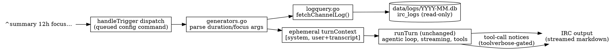

# Generators: One-Shot Agentic IRC Commands

Date: 2026-10-09

## Summary

A new command family — **generators** — of stateless, one-turn, agentic LLM commands.
First instances: `summary` (summarize the last day of channel activity from the IRC
logs) and, later, `tabloid` (tabloid front page from chat history) and `fakenews`
(satirical article about a topic, no logs). Generators render a system prompt from
config, build one user message (optionally carrying a token-capped transcript of
recent channel logs), and run the **existing** `chatRunner.runTurn` agentic loop with
an ephemeral (non-persisted) turn context. Streaming, markdown→IRC rendering, tool
calls (e.g. img-mcp image generation for tabloid/fakenews), tool-call notices,
iteration limits, empty-response retry, and pastebin-on-long-output are all inherited
unchanged.

Two reusable cores:

1. **Log-query pipeline** (`logquery.go`): `irc_logs` rows → rendered transcript →
   token-capped, newest-keeping. This is the "Phase 4+ query layer" the 2026-05-17
   irc-log-storage spec explicitly deferred.
2. **Ephemeral-turn executor** (`generators.go`): `chat()` minus persistence. Future
   one-shot commands of any kind (log-fed or not) are new TOML sections, zero code.

## Requirements (from design discussions)

- `^summary [duration] [focus...]` — no argument = configured default window
  (24h); optional duration overrides; remaining text is a focus instruction
  appended to the summarizer prompt. Output streams to the channel.
- The log retrieval → LLM prompt-input layer must be reusable by future commands.
- Local model expected for privacy (chat data stays local), but **not enforced** —
  no config validation of service locality; the admin points the command at a local
  service by choice.
- Token cap on the log transcript fed to the model; default 60,000, configurable.
- Over-budget behavior: keep the **newest** lines that fit and **disclose** — a
  marker line inside the transcript tells the model earlier content was truncated,
  and the user gets a stats notice before generation starts.
- Generators run the full agentic tool loop (tabloid/fakenews call the img tools).
- Tool-call notices (`🔧 [server] tool`) are controllable per command via the
  existing `toolverbose` option — inherited for free; `false` for gag commands.
- Generators are one-shot and **stateless**: no session row, no message
  persistence, no compaction, no follow-up turns.

## Architecture



Data flow for a log-fed generator invocation:

1. Dispatch matches the trigger (optional args allowed for log-fed commands),
   rate-checks, resolves the user, checks bans, and enqueues through
   `queueMgr.Enqueue` like any non-exempt config command. `stop` therefore works
   (queue ctx cancellation flows into `runTurn`).
2. The generator handler parses args, runs the log query, renders the system
   prompt, builds the user message, and calls `runTurn` on an ephemeral turn.
3. `runTurn` is untouched: streaming or not per config, tool loop with MCP tools
   from `mcps`, usage attribution, empty-response retry — all on the in-memory
   turn.

## Log-Query Module (`logquery.go`)

### Spec and result types

```go
type LogQuerySpec struct {
    Window    time.Duration `toml:"window"`     // default 24h
    Events    []string      `toml:"events"`     // default PRIVMSG, NOTICE, TOPIC, KICK
    MaxTokens int           `toml:"max_tokens"` // default 60000
}

type LogWindowResult struct {
    Lines        []string  // rendered transcript lines, chronological order
    Tokens       int       // token count of the kept lines
    Truncated    bool
    DroppedLines int
    TotalLines   int
    FirstKept    time.Time // actual coverage start (first kept row)
    LastKept     time.Time
    Files        []string // period files that were queried
}
```

`fetchChannelLog(spec LogQuerySpec, network, channel, model string, now time.Time) (LogWindowResult, error)` —
`model` selects the tiktoken encoding for budgeting (unknown models resolve to
`o200k_base`, approximate; chars/4 fallback when no tokenizer is available).

### File selection and querying

- Period keys mirror `LogWriter.periodKey` (monthly `2006-01` default, yearly
  `2006`) for every period between window-start and `now` — typically 1 file, 2
  at a month boundary.
- Missing period files are skipped silently (no logs that period).
- Each file is opened as a **separate short-lived gorm handle** (same sqlite
  DSN family as the writer; WAL mode allows readers to coexist with the live
  `LogWriter`). The writer's `lw.mu`/handles are never touched. Handles are
  closed after the query.
- Per-file query: `WHERE network = ? AND channel = ? AND command IN (…events…)`
  `AND created_at BETWEEN ? AND ?` `ORDER BY created_at ASC, id ASC` — rides
  `idx_irc_logs_channel_time`. Results across files (disjoint ranges) are merged
  in timestamp order.
- **Channel matching is exact on the stored string**: the writer persists raw
  `event.Params[0]`, and the reader's channel comes from the same girc delivery,
  so they agree by construction. No casemapping normalization is applied,
  deliberately matching writer behavior.
- **Row cap**: 1,000,000 rows across the window aborts with a distinct error →
  user-facing `window_too_large` notice (bounds memory on absurd durations; the
  token cap bounds the prompt but not the scan).

### Line rendering (token-cheap, one line per event)

| Event   | Render |
|---------|--------|
| PRIVMSG | `[HH:MM] <nick> text` |
| PRIVMSG (CTCP ACTION) | `[HH:MM] * nick action` |
| NOTICE  | `[HH:MM] -nick- text` |
| TOPIC   | `[HH:MM] *** nick set topic: text` |
| KICK    | `[HH:MM] *** nick kicked target (reason)` |
| JOIN    | `[HH:MM] *** nick joined` (opt-in) |
| PART    | `[HH:MM] *** nick parted (reason)` (opt-in) |
| QUIT    | `[HH:MM] *** nick quit (reason)` (opt-in) |
| NICK    | `[HH:MM] *** oldnick is now known as newnick` (opt-in) |
| MODE    | `[HH:MM] *** nick set mode +o bob` (opt-in) |

A date separator line `--- 2026-10-08 ---` is emitted whenever the (server-local)
day changes between consecutive rows. The bot's own messages are included
(`enqueueBotMessage` rows) — the model sees its own past participation, and the
invoking `^summary …` line appearing is harmless.

### Token accounting and truncation (keep newest, disclose)

- Each rendered line is counted with the offline tiktoken loader from
  `tokencount.go` (`EncodeOrdinary`; the lib's default downloading loader is
  never reachable — the vendored rank tables are mandatory here too).
- Lines are walked tail→head accumulating counts until the budget
  (`MaxTokens`) is reached; the head is dropped.
- When anything is dropped, a marker line is **prepended to the transcript**:
  `[... N earlier lines omitted to fit the 60000-token budget ...]` — the model
  is told the beginning is missing so it can caveat the summary.
- `Truncated`/`DroppedLines`/`FirstKept` also feed the user-facing notice.

## Ephemeral Turn Machinery

Minimal, surgical changes so the real agentic loop runs without persistence:

- `turnContext` gains an `ephemeral bool` and a constructor
  `newEphemeralTurnContext(initial []ChatMessage)`. `Add()` appends in memory
  and **skips `sessionMgr`** when ephemeral. Everything else about the turn is
  identical.
- `chatRunner` gains an `ephemeral bool`, set only by the generator path. It
  gates exactly two things:
  - `handleResponseIDSave`: do not persist response ids (nothing to persist
    on). `previous_response_id` chaining is therefore impossible for
    generators — documented as such.
  - `getTools()`: builtin tools (`register_background_job`, `ban_user`,
    `check_ban_history`) are **not offered** for ephemeral runs —
    background-job delivery is session-bound; ban tools are chat-moderation
    concerns. MCP tools from `cfg.MCPs` are unaffected. A hallucinated builtin
    falls into the existing unknown-tool error path.
- **No other guards are needed**:
  - `storeUsage` writes `TurnUsage{SessionID: 0, …}` — the column is
    `not null` but FK-less, and the denormalized `Model`/`Service`/
    `ReasoningEffort` columns give generator calls the same cost attribution
    as chat turns. `/tokencount` and per-session queries are unaffected
    (they target real session ids).
  - `apiLogger` already no-ops on session id 0 (`RestoreSession`,
    `LogRequest`, …): ephemeral runs produce **no api-log files**. Accepted;
    the INFO breadcrumbs in the main log remain.
  - Compaction and the pending-job delivery loop are simply not invoked by
    the generator path.
- **Async MCP tools**: no new machinery. img-mcp's async pair can even be
    driven synchronously via `wait_for_job` inside the turn. Example configs
    hide the async tools anyway (sync tools are the natural fit) — see §Config.
- **Tool-call notices**: gated by the existing per-command `toolverbose`
  (cascade command > service, default true) inside `executeToolCalls` —
  inherited unchanged. Gag commands set `toolverbose = false`.

## Executor (`generators.go`)

`generator(network, client, event, cfg GeneratorConfig, ctx, output, resolvedUser, args...)`
mirrors `chat()` minus persistence:

1. `newChatRunner`, resolve the user from ctx (identical pattern to `chat()`).
2. **Arg grammar**:
   - Log-fed commands (`cfg.Log != nil`): an optional leading duration token —
     one or more `\d+[smhd]` groups concatenated (`90m`, `12h`, `2d`, `1d12h`) —
     overrides `spec.Window` for this invocation. Bare digits do **not** match
     the grammar and remain focus text. The remainder is free-form focus text.
   - Non-log commands: plain required args (the topic/prompt), like
     completions.
3. Log-fed commands run `fetchChannelLog`:
   - Zero rows → error notice `[generators] no_activity`, **no LLM call**.
   - Truncated → warn notice with stats (kept/total lines, tokens vs budget,
     actual coverage) sent before generation starts.
   - Row cap → error notice `window_too_large`.

   Note there is deliberately **no** `bad_duration` error: a leading token that
   doesn't match the duration grammar is focus text by design (`^summary 24`
   summarizes the default window with focus "24"). The command's help text
   documents the expected format.
4. System prompt: same `SystemTmpl` render as chats (`buildSystemPromptData` +
   `asyncResultRole(cfg)` — harmless; generator templates should not rely on
   `AsyncResultRole`).
5. User message: focus text, else `cfg.Prompt` (per-command default
   instruction), else builtin default `"Summarize the following channel
   activity."` For log-fed commands the message continues with a header line
   (channel, network, requested window, line/token counts) and the transcript.
6. `turn := newEphemeralTurnContext([]{system, user})`; `runner.sessionID`
   stays 0; `runTurn(turn)`. Done — no compaction, no job-delivery loop.

`runTurn` is not modified. Streaming, markdown rendering, tool calls,
iteration limits, and empty-response retry all apply to generators exactly as
they do to chats.

## Config (`config/generators.toml`)

Follows the repo's config documentation convention (reference block + commented
example). Loaded by `loadCommandsDir` (missing file = empty map, not fatal);
hot-reloadable via `/reload` → `registerCommands`.

```go
type GeneratorConfig struct {
    AIConfig                     // embedded: BurntSushi decodes AIConfig fields at the parent level
    Prompt string      `toml:"prompt"` // default instruction when the caller gives no focus text
    Log    *LogQuerySpec `toml:"log"`  // present = log-fed command (optional args, transcript injection)
}
```

`Commands` gains `Generators map[string]GeneratorConfig`.

AIConfig fields that are **not useful** for generators (documented in the
file): `previous_response_id` (stateless — ids are never persisted for
ephemeral runs, so no chaining can occur) and `detectimages` (args are plain
text v1). The builtin-tool knob `disabled_builtin_tools` is moot (builtins are
never offered). `responses_api` may be set — the Responses API request shape
is honored — but without persisted ids it only changes the endpoint shape.
Everything else — `service`, `model`, `aliases`, `system`,
`streaming`, `rendermarkdown`, `temperature`, `maxtokens`/`maxcompletiontokens`,
`timeout`/`streamtimeout`, `load_notice`, `mcps`, `hidden_mcp_tools`,
`toolverbose`, `extra_body`, `chat_template_kwargs`, `api_user` — applies as in
chats (`ApplyDefaults` cascade included).

Validation (error-returning, reload-safe):

- `service` must exist in `services.toml`.
- `window` (and any defaults) must parse as a duration with `d` suffix support
  (generalize `parseBanDuration`'s unit handling rather than duplicating it).
- `events` ⊆ {PRIVMSG, NOTICE, JOIN, PART, QUIT, KICK, NICK, TOPIC, MODE}.
- `max_tokens > 0`.
- Log-block defaults when fields are unset: `window = "24h"`,
  `events = ["PRIVMSG","NOTICE","TOPIC","KICK"]`, `max_tokens = 60000`.

Example sections (to ship in the file, adapted per environment):

```toml
[summary]
description = "Summarize recent channel activity"
service = "llama-local"          # local service for privacy (not enforced)
model = "qwen3-32b"
streaming = true
rendermarkdown = true
prompt = "Summarize the following channel activity."
system = """You are {{.BotNick}}, summarizing recent activity in {{.Channel}} on {{.Network}}.
Cover the main topics, notable events, and who participated. Be concise but
specific; use IRC formatting. If the transcript begins with a truncation
marker, say that coverage starts mid-window."""
[summary.log]
window = "24h"
events = ["PRIVMSG", "NOTICE", "TOPIC", "KICK"]
max_tokens = 60000

[fakenews]
description = "Satirical fake-news article about a topic"
service = "llama-local"
model = "qwen3-32b"
streaming = true
rendermarkdown = true
toolverbose = false              # no 🔧 tool-call chatter — spoils the output
mcps = ["img-mcp"]
hidden_mcp_tools = ["generate_image_async", "enhance_and_generate_async", "wait_for_job", "job_status", "list_jobs", "cancel_job"]
# no [fakenews.log] → plain required args (the topic), no transcript
```

## Registration & Dispatch

- `registerCommandsLocked` iterates `cmds.Generators`: `addTrigger` (conflict
  detection against chats/completions/tools included), `configCmds` /
  `configCmdNames` entries.
- **takesArgs**: `Log == nil` → required args (like completions). `Log != nil`
  → the trigger is added to a new `configCmdOptionalArgs` map.
- `irc_handlers.go` dispatch predicate extended:
  `takesArgs == hasArgs || (optionalArgs[trigger] && !hasArgs)` — bare
  `^summary` and `^summary 6h focus` both dispatch; absent args are passed as
  an empty string.
- Generators are **not** in `chatCmds` (no context to clear) and **not**
  rate-exempt → the normal queued path applies: rate check → `queueMgr.Enqueue`
  with the command's service (queue parallelism accounting works) → position
  notices.

## Notices (`notices.toml` → `[generators]`)

| Key | Level | Vars |
|-----|-------|------|
| `no_activity` | error | `{window}` |
| `truncated` | warn | `{kept}`, `{total}`, `{tokens}`, `{budget}`, `{coverage}` |
| `window_too_large` | error | `{rows}`, `{cap}` |

Hardcoded fallbacks via `setNoticesDefaults()`; hot-reloadable like all
notices.

## Help

`buildHelpText` and `buildPastebinHelpText` gain a "Generators" group listing
trigger words + descriptions, mirroring the completions/chats groups.

## Observability

- Start-of-run INFO log: trigger, window (requested + actual coverage), files
  queried, rows scanned, lines kept/dropped, token total, truncated flag.
- `TurnUsage` rows (SessionID 0) attribute cost per model/service in existing
  stats tooling.

## Files

**New**: `generators.go`, `logquery.go`, `generators_test.go`,
`logquery_test.go`, `config/generators.toml`.

**Modified**: `config.go` (struct/load/validate), `turncontext.go` (ephemeral),
`aiCmds.go` (two `ephemeral` guards), `irc_handlers.go` (dispatch predicate),
`main.go` (registration loop), `notices.go` (+ defaults), `help.go`,
`config/notices.toml`, AGENTS.md.

## Testing

- **logquery_test.go**: per-event line rendering (incl. CTCP ACTION, day
  separators); keep-newest truncation + marker + token math; multi-file merge
  across a month boundary; missing-file skip; events filter; row cap;
  zero-row result; duration-arg grammar (compound units, bare digits stay
  focus text).
- **config tests**: load/validate `generators.toml` — defaults, invalid
  window/events/max_tokens, missing service, missing file OK, hot-reload
  swap, trigger-conflict detection with chats/completions.
- **executor tests** (mockChatRunner / httptest patterns): ephemeral turn
  persists nothing (mock session manager asserts no writes); tool loop works
  (mock MCP round-trip); no-activity / truncation / row-cap notices;
  `TurnUsage` row with SessionID 0; builtins excluded from offered
  tools; response-id not persisted; `toolverbose = false` suppresses tool
  notices.
- **dispatch tests**: optional-args matching (bare + with args); queue
  integration; `stop` cancels a running generator.

## Out of Scope (Future)

- Async background jobs for stateless commands (needs sessionless result
  delivery to a channel).
- API-log files for ephemeral runs.
- Exposing log queries to the model as a tool (model-chosen windows).
- Transcript format knobs beyond `events`/`max_tokens`.
- Configurable per-event rendering styles.
